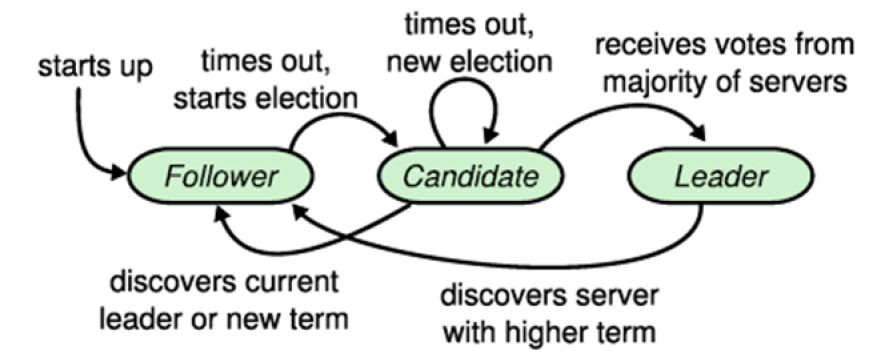
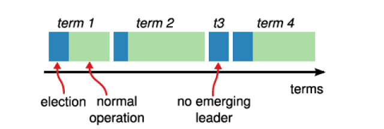
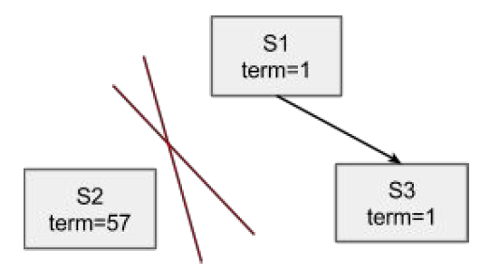
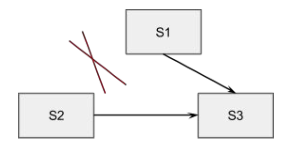
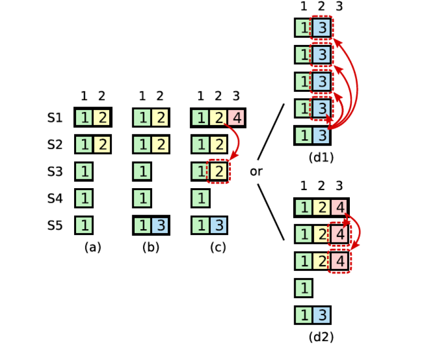
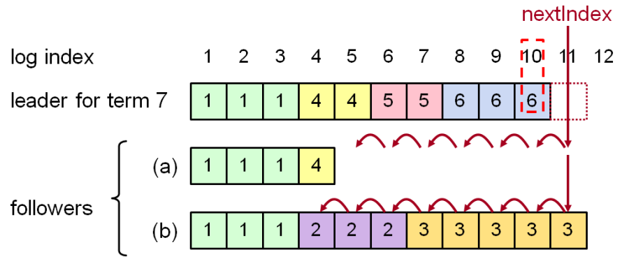
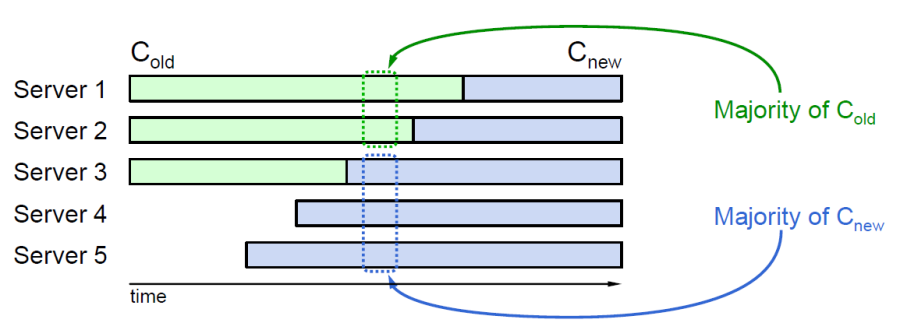
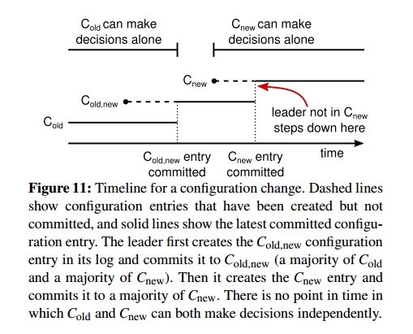
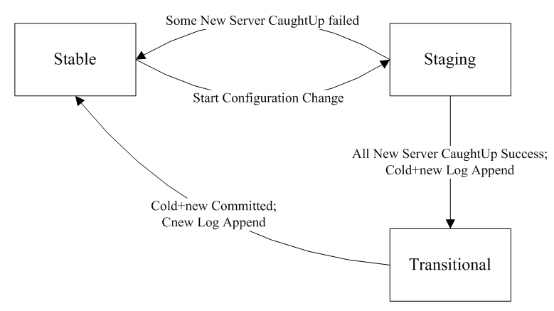

# RAFT介绍

当前业界有很多分布式一致性复制协议，比如Paxos，Zab，Viewstamped Replication等，其中Lamport提出的Paxos被认为是分布式一致性复制协议的根本，其他的一致性复制协议都是其变种。但是Paxos论文中只给出了单个提案的过程，并没有给出复制状态机中需要的MultiPaxos的相关细节描述。Zab协议被应用在Zookeeper中，业界使用广泛，但是没有抽象成通用library。Viewstamped Replication虽然出来的比较早，但是一直没有流行起来，也没有几个实现。基于这几类分布式一致性复制协议可以构建满足CP(强一致性和分区容忍性)的分布式系统，对于可用性会因为保证多数副本存活和选主期间不可读写而打些折扣。
RAFT是斯坦福大学RamCloud项目中提出的分布式一致性复制协议，以易于理解著称，自推出之后业界涌现了很多RAFT的实现，包括CoreOS的etcd等。RAFT相比Zab和Viewstamped Replication简化了协议中的状态和交互，更加清晰容易理解，更加容易实现。下表给出了Multi-Paxos、RAFT、Zab和ViewStamped Replication的对比：

|                       | **Multi-Paxos** | **RAFT** | **Zab** | **Viewstamped Replication** |
| --------------------- | --------------- | -------- | ------- | --------------------------- |
| Leader Election       | Yes             | Yes      | Yes     | Yes                         |
| Log Replication       | Yes             | Yes      | Yes     | Yes                         |
| Log Recovery          | Yes?            | Yes      | Yes     | Yes                         |
| Log Compaction        | Yes?            | Yes      | Yes     | Yes                         |
| Membership Management | Yes?            | Yes      | No      | Yes                         |
| Understandable        | Hard            | Easy     | Medium  | Medium                      |
| Protocol Details      | No              | Yes      | Yes     | Yes                         |
| Implements            | Few             | Mass     | Many    | Few                         |

RAFT中将节点状态分为：

- Leader：接收Client的请求，并进行复制，任何时刻只有一个Leader
- Follower：被动接收各种RPC请求
- Candidate：用于选举出一个新的Leader

RAFT中Follower长时间没有接受到心跳就会转为Candidate状态，收到多数投票应答之后可以转为Leader，Leader会定期向其他节点发送心跳。当Leader和Candidate接收到更高版本的消息后，转为Follower。具体节点状态转移图如下：

RAFT比较优雅的解决了上面复制状态机中的几个问题，下面对选主、修复和节点变更等方面展开详细描述。

## Leader Election

RAFT中将时间划分到Term，用于选举，标示某个Leader下的Normal Case，每个Term最多只有一个Leader，某些term可能会选主失败而没有Leader（未达到多数投票应答而超时）。

RAFT的选主过程中，每个Candidate节点先将本地的Current Term加一，然后向其他节点发送RequestVote请求，其他节点根据本地数据版本、长度和之前选主的结果判断应答成功与否。具体处理规则如下：

1. 如果now – lastLeaderUpdateTimestamp < elect_timeout，忽略请求
2. 如果req.term < currentTerm，忽略请求。
3. 如果req.term > currentTerm，设置req.term到currentTerm中，如果是Leader和Candidate转为Follower。
4. 如果req.term == currentTerm，并且本地voteFor记录为空或者是与vote请求中term和CandidateId一致，req.lastLogIndex > lastLogIndex，即Candidate数据新于本地则同意选主请求。
   
5. 如果req.term == currentTerm，如果本地voteFor记录非空或者是与vote请求中term一致CandidateId不一致，则拒绝选主请求。（你+1才等于我，说明你延迟。）

6. 如果lastLogTerm > req.lastLogTerm，本地最后一条Log的Term大于请求中的lastLogTerm，说明candidate上数据比本地旧，拒绝选主请求。(我是最新的，拒绝你投票)

上面的选主请求处理，符合Paxos的"少数服从多数，后者认同前者"的原则。按照上面的规则，选举出来的Leader，一定是多数节点中Log数据最新的节点。下面来分析一下选主的时间和活锁问题，设定Follower检测Leader Lease超时为

HeartbeatTimeout，Leader定期发送心跳的时间间隔将小于HeartbeatTimeout，避免Leader Lease超时，通常设置为小于 HeartbeatTimeout/2。当选举出现冲突，即存在两个或多个节点同时进行选主，且都没有拿到多数节点的应答，就需要重新进行选举，这就是常见的选主活锁问题。RAFT中引入随机超时时间机制，有效规避活锁问题。


注意上面的Log新旧的比较，是基于lastLogTerm和lastLogIndex进行比较，而不是基于currentTerm和lastLogIndex进行比较。
currentTerm只是用于忽略老的Term的vote请求，或者提升自己的currentTerm，并不参与Log新旧的决策。
考虑一个非对称网络划分的节点，在一段时间内会不断的进行vote，并增加currentTerm，这样会导致网络恢复之后，Leader会接收到AppendEntriesResponse中的term比currentTerm大，Leader就会重置currentTerm并进行StepDown，这样Leader就对齐自己的Term到划分节点的Term，重新开始选主，最终会在上一次多数集合中选举出一个term>=划分节点Term的Leader。

### Symmetric network partitioning

原始的RAFT论文中对于对称网络划分的处理是，一个节点再次上线之后，Leader接收到高于currentTerm的RequestVote请求就进行StepDown。这样即使这个节点已经通过RemovePeer删除了，依然会打断当前的Lease，导致复制组不可用。对于这种case可以做些特殊的处理：Leader不接收RequestVote请求，具体情况如下：

- 对于属于PeerSet中的节点，Leader会在重试的AppendEntries中因为遇到更高的term而StepDown
- 对于不属于PeerSet中的节点，Leader永远忽略



这样，属于PeerSet中的节点最终能够加入，不属于PeerSet的节点不会加入也不会破坏。如果网络划分是因为节点故障导致的，那么稳定的多数复制组不会收到更高term的AppendEntries应答，Leader不会StepDown，这样节点可以安静的加入集群。

### Asymmetric network partitioning

原始的RAFT论文中对非对称的网络划分处理不好，比如S1、S2、S3分别位于三个IDC，其中S1和S2之间网络不通，其他之间可以联通。这样一旦S1或者是S2抢到了Leader，另外一方在超时之后就会触发选主，例如S1为Leader，S2不断超时触发选主，S3提升Term打断当前Lease，从而拒绝Leader的更新。这个时候可以增加一个trick的检查，每个Follower维护一个时间戳记录收到Leader上数据更新的时间，只有超过ElectionTImeout之后才允许接受Vote请求。这个类似Zookeeper中只有Candidate才能发起和接受投票，就可以保证S1和S3能够一直维持稳定的quorum集合，S2不能选主成功。



### StepDown

RAFT原始协议中Leader收到任何term高于currentTerm的请求都会进行StepDown，在实际开发中应该在以下几个时刻进行StepDown：

- Leader接收到AppendEntries的失败应答，Term比currentTerm大
- Leader在ElectionTimeout内没有写多数成功，通过logic clock检查实现（1个ElectionTimeout内会有10个HeartBeat）
- Leader在进行RemovePeer的LogEntry被Commit的时候，不在节点列表中，进行StepDown，通常还会进行Shutdown

## Log Replication

一旦选举出了一个leader，它就开始负责服务客户端的请求。每个客户端的请求都包含一个要被复制状态机执行的指令。leader首先要把这个指令追加到log中形成一个新的entry，然后通过AppendEntries RPCs并行的把该entry发给其他servers，其他server如果发现没问题，复制成功后会给leader一个表示成功的ACK，leader收到大多数ACK后应用该日志，返回客户端执行结果。如果followers crash或者丢包，leader会不断重试AppendEntries RPC。Logs按照下图组织：


每个log entry都存储着一条用于状态机的指令，同时保存从leader收到该entry时的term号。该term号可以用来判断一些log之间的不一致状态。每一个entry还有一个index指明自己在log中的位置。

leader需要决定什么时候将日志应用给状态机是安全的，可以被应用的entry叫committed。RAFT保证committed entries持久化，并且最终被其他状态机应用。一个log entry一旦复制给了大多数节点就成为committed。同时要注意一种情况，如果当前待提交entry之前有未提交的entry，即使是以前过时的leader创建的，只要满足已存储在大多数节点上就一次性按顺序都提交。leader要追踪最新的committed的index，并在每次AppendEntries RPCs（包括心跳）都要捎带，以使其他server知道一个log entry是已提交的，从而在它们本地的状态机上也应用。具体Log Entry的状态转移图如下：
 

每个节点重启之后，先加载上一个Snapshot，再加入RAFT复制组，选主或者是接收更新。因为Snapshot中的数据一定是Applied，那么肯定是Committed的，加载是安全的。但是Log中的数据，不一定是Committed的，因为我们没有持久化CommittedIndex，所以不确定Log是否是Committed，不能进行加载。这样先加载Snapshot虽然延迟了新节点加入集群的时间，但是能够保证一旦一个节点变为Leader之后能够比较快的加载完全数据，并提供服务。同理，Follower接收到InstallSnapshot之后，接收并加载完Snapshot之后再回复Leader。

### Log Recovery

1. 未Committed的数据转变为Committed

Log Recovery这里分为current Term修复和prev Term修复，Log Recovery就是要保证一定已经Committed的数据不会丢失，未Committed的数据转变为Committed，但不会因为修复过程中断又重启而影响节点之间一致性。

2.   全量复制

current Term修复主要是解决某些Follower节点重启加入集群，或者是新增Follower节点加入集群，Leader需要向Follower节点传输漏掉的Log Entry，如果Follower需要的Log Entry已经在Leader上Log Compaction清除掉了，Leader需要将上一个Snapshot和其后的Log Entry传输给Follower节点。


Leader-Alive模式下，只要Leader将某一条Log Entry复制到多数节点上，Log Entry就转变为Committed。

3. pre term 
   
prev Term修复主要是在保证Leader切换前后数据的一致性。

通过上面RAFT的选主可以看出，每次选举出来的Leader一定包含已经committed的数据（抽屉原理，选举出来的Leader是多数中数据最新的，一定包含已经在多数节点上commit的数据），新的Leader将会覆盖其他节点上不一致的数据。
虽然新选举出来的Leader一定包括上一个Term的Leader已经Committed的Log Entry，但是可能也包含上一个Term的Leader未Committed的Log Entry。这部分Log Entry需要转变为Committed，

相对比较麻烦，需要考虑Leader多次切换且未完成Log Recovery，需要保证最终提案是一致的，确定的。

RAFT中增加了一个约束：
>对于之前Term的未Committed数据，修复到多数节点，且在新的Term下至少有一条新的Log Entry被复制或修复到多数节点之后，才能认为之前未Committed的Log Entry转为Committed。

下图就是一个prev Term Recovery的过程：


1. S1是Term2的Leader，将LogEntry部分复制到S1和S2的2号位置，然后Crash。
2. S5被S3、S4和S5选为Term3的Leader，并只写入一条LogEntry到本地，然后Crash。
3. S1被S1、S2和S3选为Term4的Leader，并将2号位置的数据修复到S3，达到多数；并在本地写入一条Log Entry，然后Crash。
4. 这个时候2号位置的Log Entry虽然已经被复制到多数节点上，但是并不是Committed。
   1. S5被S3、S4和S5选为Term5的Leader，将本地2号位置Term3写入的数据复制到其他节点，覆盖S1、S2、S3上Term2写入的数据
   2. S1被S1、S2、S3选为Term5的Leader，将3号位置Term4写入的数据复制到S2、S3，使得2号位置Term2写入的数据变为Committed 

数据s1的2 和s5的3。
都没有经过复制到大多数统一，但是只要写入了
最后会修复成大多数统一。
这里前提条件是什么
是业务已经返回成功了吗？


通过上面的流程可以看出，在prev Term Recovery的情况下，只要Log Entry还未被Committed，即使被修复到多数节点上，依然可能不是Committed，必须依赖新的Term下再有新的Log Entry被复制或修复到多数节点上之后才能被认为是Committed。
选出Leader之后，Leader运行过程中会进行副本的修复，这个时候只要多数副本数据完整就可以正常工作。

Leader为每个Follower维护一个nextId，标示下一个要发送的logIndex。Follower接收到AppendEntries之后会进行一些一致性检查，检查AppendEntries中指定的LastLogIndex是否一致，如果不一致就会向Leader返回失败。

Leader接收到失败之后，会将nextId减1，重新进行发送，直到成功。

这个回溯的过程实际上就是寻找Follower上最后一个CommittedId，然后Leader发送其后的LogEntry。

因为Follower持久化CommittedId将会导致更新延迟增大，回溯的窗口也只是Leader切换导致的副本间不一致的LogEntry，这部分数据量一般都很小。

 


上图中Follower a与Leader数据都是一致的，只是有数据缺失，可以优化为直接通知Leader从logIndex=5开始进行重传，这样只需一次回溯。Follower b与Leader有不一致性的数据，需要回溯7次才能找到需要进行重传的位置。

重新选取Leader之后，新的Leader没有之前内存中维护的nextId，以本地lastLogIndex+1作为每个节点的nextId。这样根据节点的AppendEntries应答可以调整nextId：

**nextIndex**

```cpp
local.nextIndex = max(min(local.nextIndex-1, resp.LastLogIndex+1), 1)
```

## Log Compaction

更新通过Leader写入Log，复制到多数节点，变为Committed，再提交业务状态机。在实际系统中，当这个流程长时间跑的时候，Log就会无限制增长，导致Log占用太多的磁盘空间，需要更长的启动时间来加载。如果不采取一些措施进行Log Compaction最终将会导致系统不可用。

Snapshot是Log Compaction的常用方法，将系统的全部状态写入一个Snapshot中，并持久化的一个可靠存储系统中，完成Snapshot之后这个点之前的Log就可以被删除了。


Snapshot的时候，除了业务状态机dump自己的业务数据之外，还需要一些元信息：

- last included index：做Snapshot的时候最后apply的log entry的index
- last included term：做Snapshot的时候最后apply的log entry的term
- last included configuration：做Snapshot的时候最后的Configuration

因为做完Snapshot之后，last include index及其之前的Log都会被删除，这样再次重启需要恢复term、index和cofiguration等信息，考虑Snapshot之后没有写入并重启的情况。

做Snapshot的时机选择，对系统也是有影响的。如果过于频繁的Snapshot，那么将会浪费大量的磁盘带宽；如果过于不频繁的Snasphot，那么Log将会占用大量的磁盘空间，启动速度也很慢。一个简单的方式就是当Log达到一定大小之后再进行Snapshot，或者是达到一定时间之后再进行Snapshot。这个根据业务场景来判断，如果Log加载速度很快，可以采用定量Snapshot的方式，并且定量的大小可以远大于Snapshot的大小；如果Log加载速度很慢，可以采用定期Snapshot的方式，避免Log太长。

Snapshot会花费比较长的时间，如果期望Snapshot不影响正常的Log Entry同步，需要采用Copy-On-Write的技术来实现。例如，底层的数据结构或者是存储支持COW，LSM-Tree类型的数据结构和KV库一般都支持Snapshot；或者是使用系统的COW支持，Linux的fork，或者是ZFS的Snapshot等。

### InstallSnapshot

正常情况下，Leader和Follower独立的做Snapshot，但是当Leader和Follower之间Log差距比较大的时候，Leader已经做完了一个Snapshot，但是Follower依然没有同步完Snapshot中的Log，这个时候就需要Leader向Follower发送Snapshot。

Follower收到InstallSnapshot请求之后的处理流程如下：

1. 检查req.term < currentTerm直接返回失败
2. 创建Snapshot，并接受后续的数据
3. 保存Snapshot元信息，并删除之前的完成的或者是未完成的Snapshot
4. 如果现存的LogEntry与snapshot的last_included_index和last_include_term一致，保留后续的log；否则删除全部Log
5. Follower重新加载Snapshot

由于InstallSnapshot请求也可能会重传，或者是InstallSnapshot过程中发生了Leader切换，新Leader的last_included_index比较小，可能还有UnCommitted的LogEntry，这个时候就不需要进行InstallSnapshot。所以Follower在收到InstallSnapshot的时候，Follower不是直接删除全部Log，而是将Snapshot的last_include_index及其之前的Log Entry删掉，last_include_index后续的Log Entry继续保留。如果需要保留后面的Log Entry，这个时候其实不用进行加载Snapshot了，如果全部删除的话，就需要重新加载Snapshot恢复到最新的状态。

由于Snapshot可能会比较大，RPC都有消息大小限制，需要采用些手段进行处理：可以拆分数据采用N个RPC，每个RPC带上offset和data的方式；也可以采用Chunk的方式，采用一个RPC，但是拆分成多个Chunk进行发送。

## Membership Management

分布式系统运行过程中节点总是会存在故障报修，需要支持节点的动态增删。节点增删过程不能影响当前数据的复制，并能够自动对新节点进行数据修复，如果删除节点涉及Leader，还需要触发自动选主。直接增加节点可能会导致出现新老节点结合出现两个多数集合，造成冲突。下图是3个节点的集群扩展到5个节点的集群，直接扩展可能会造成Server1和Server2构成老的多数集合，Server3、Server4和Server5构成新的多数集合，两者不相交从而可能导致决议冲突。


### Joint-Consensus

RAFT采用协同一致性的方式来解决节点的变更，先提交一个包含新老节点结合的Configuration命令，当这条消息Commit之后再提交一条只包含新节点的Configuration命令。新老集合中任何一个节点都可以成为Leader，这样Leader宕机之后，如果新的Leader没有看到包括新老节点集合的Configuration日志（这条configuration日志在老节点集合中没有写到多数），继续以老节点集合组建复制组（老节点集合中收到configuration日志的节点会截断日志）；如果新的Leader看到了包括新老节点集合的Configuration日志，将未完成的节点变更流程走完。具体流程如下：

1. 首先对新节点进行CaughtUp追数据
2. 全部新节点完成CaughtUp之后，向新老集合发送Cold+new命令
3. 如果新节点集合多数和老节点集合多数都应答了Cold+new，就向新老节点集合发送Cnew命令
4. 如果新节点集合多数应答了Cnew，完成节点切换

配置改变示意图如下：



下面是节点变更过程中的状态转移图：



 

节点配置变更过程中需要满足如下规则：

- 新老集合中的任何节点都可能成为Leader
- 任何决议都需要新老集合的多数通过

结合上面的流程和状态转移图，如果Cold+new被Commit到新老集合多数的话，即使过程终止，新的Leader依然能够看到Cold+new，并继续完成Cnew的流程，最终完成节点变更；如果Cold+new没有提交到新老集合多数的话，新的Leader可能看到了Cold+new也可能没有看到，如果看到了依然可以完成Cnew的流程，如果没有看到，说明Cold+new在两个集合都没有拿到多数应答，重新按照Cold进行集群操作。这里说明一下选主过程，两阶段过程中选主需要新老两个集合都达到多数同意。

### Single-Server Change

其实上面的流程可以简化，每次只增删一个节点，这样就不会出现两个多数集合，不会造成决议冲突的情况。按照如下规则进行处理：

1. Leader收到AddPeer/RemovePeer的时候就进行处理，而不是等到committed，这样马上就可以使用新的peer set进行复制AddPeer/RemovePeer请求。
2. Leader启动的时候就发送NO_OP请求，将上一个AddPeer/RemovePeer变为committed。
3. Leader在删除自身节点的时候，会在RemovePeer被Committed之后，进行关闭。

按照上面的规则，可以实现安全的动态节点增删，因为节点动态调整跟Leader选举是两个并行的过程，节点需要一些宽松的检查来保证选主和AppendEntries的多数集合：

1. 节点可以接受不是来自于自己Leader的AppendEntries请求
2. 节点可以为不属于自己节点列表中的Candidate投票

单节点变更有几个问题：

1. 以老节点集还是新节点集作为Configuration Change日志的节点集
2. 什么时候修改本地内存中节点集合

Configuration Change无论基于新节点集还是老节点集都不会破坏“新老节点集的多数至少有一个节点相交”。

1. 基于老节点集的问题是，对于2个节点的集群，挂掉1台之后没法进行add_peer或者是remove_peer。其实可以推广到偶数节点故障一半，基于老节点集的add_peer/remove_peer都无法完成。基于老节点集，可以省掉leader启动时候的NO_OP日志，同时被删除的节点还可以收到remove_peer而自动进行shutdown。leader在同步Configuration Change日志过程中宕机，老节点集中重新选出一个leader，要么恢复到old Configuration，要么继续new Configuration change。
2. 基于新节点集在Configuration Change日志之前的日志都Committed的话，是可以解决上面的偶数节点挂一半的case，但实际意义不大。基于新节点集，需要在leader启动的时候写入一条NO_OP日志。leader在同步Configuration Change日志过程中宕机，merge(老节点集,新节点集)中重新选出一个leader，要么恢复到old Configuration，要么继续new Configuration change。

对于什么时候修改本地节点集合，只需要保证Configuration Change下不会导致Committed的Log不会被覆盖就可以，Configuration Change之后的Log采用新集合还是老集合都不会破坏这个规则。

RAFT作者论文中是采用新节点集且本地写下Configuration Change Log就修改内存Configuration的方案，etcd中采用老节点集且在老节点集中多数达成Committed后再修改内存Configuration的方案。

在偶数节点集群删除一个节点的时候，在remove_peer之前的日志的counting replica比之后的日志多，可能后面的日志先满足counting。如果后面的日志变为committed，前面的日志也是committed，因为老的configuration的多数节点集不会选为leader，从而不会发生覆盖。hashicorp的实现是严格按序进行committed，即只有前面的日志都满足counting之后才能变为committed。

对于多数节点故障的时候，leader应该step down，通过set_peer向新节点集中每个节点设置相同的节点集，触发它们重新选主，新的leader再写入一条add_peer的log（以set_peer设置的节点集为准进行同步）。

另外Leader启动的时候先发送一个AddPeer或者是NOP请求是非常重要的：如果集群数量为偶数，并且上一个Leader最后在进行节点变更的时候宕机没有commit到多数；新的Leader如果启动就改变其节点集合，按照新节点集可能判断为Committed，但是之前老的Leader启动之后按照新的节点集合形成另外一个多数集合将之前未Commit的节点变更日志变为Committed，这样就产生了脑裂，可能会造成数据丢失。新的Leader启动之后必须Commit一条数据非节点变更日志后才能够进行发起节点变更，这条Committed的非节点变更日志可以保证至少跟之前UnCommitted的日志有一个节点交集，这样就可以保证UnCommitted的节点变更日志不会再变为Committed。详细讨论参见：<https://groups.google.com/forum/#!topic/RAFT-dev/t4xj6dJTP6E>

### Configuration Store

Configuration在节点重启之后必须跟节点挂掉之前的Configuration保持一致，也就是说Configuration是跟Log一致的。如果单独找一个地方存Configuration，需要保证Configuration的存储和Log的存储是原子的，并且是可重入的。Configuration的存储发生在Configuration Change日志被写入的时候，对于Leader来讲开始异步写入就需要存储，对于Follower来讲写入成功才需要存储。Configuration Change之前还没有Committed的LogEntry原则上只需要Old节点集多数应答即可，实际中可以约束到Old节点集和New节点集都多数应答，这样能简化Configuration的管理。

Snapshot中保存的Configuration，一定是Applied的，肯定是Committed。但是Log中的Configuration可能是UnCommitted的，因为没有记录CommittedIndex。启动前需要先扫描一遍Log获取其中的Configuration，这里不仅仅是获取最后一个Configuration。因为最后的Configuration Change Log可能是UnCommitted从而被Overwrite，之后需要查找上一个Configuration，所以需要拿到Log中全部的Configuration。在完成选主之后，使用最后一个Configuration作为节点列表配置。通过定期将全部Configuration持久化，可以加快启动前的扫描速度，只扫描记录的最后一个Configuration之后的Log。

## Safety

前面对RAFT的一些处理流程进行了一些描述，但是对于RAFT的安全性保证并没有进行太多的描述。比如某个Follower暂时离线，Leader又Commit了一些LogEntry，这个Follower再次上线之后被选为Leader，覆盖这部分LogEntry，这样就会导致不同的状态机执行了不同的命令。
RAFT保证任意时刻如下属性都为真：

- Election Safety：给定Term下最多只有一个Leader被选举出来。
- Leader Append-Only：Leader不会覆盖或者是删除自己的Entry，只会进行Append。
- Log Matching：如果两个Log拥有相同的Term和Index，那么给定Index之前的LogEntry都是相同的。
  - 如果两个Log拥有相同的Term和Index，那么他们拥有相同的内容
  - 如果两个Log拥有相同的term和Index，那么之前的Log也都是一样的
- Leader Completeness：如果一条LogEntry在某个Term下被Commit了，那么这条LogEntry必然存在于后面Term的Leader中。
- State Machine Safety：如果一个节点已经Apply了一条LogEntry到状态机，那么其他节点不会向状态机中Apply相同Index下的不同的LogEntry。

RAFT中有一个Leader Completeness属性来保证任意term的Leader都包含了之前term的已经committed的LogEntry，通过Leader Completeness约束RAFT选出来的Leader一定包含全部已经committed的数据，具体来讲就是比较最后一条LogEntry的index和term。下面我们对Leader Completeness进行证明，假定term T的Leader（LeaderT）在其term下commit了一条LogEntry，之后几个Term的Leader都包含这条LogEntry，但是在Term U(U > T)中不包含这条LogEntry：

1. LeaderU的Committed Log中一定不包含这条LogEntry，因为Leader从不会删除或者是覆盖自己的LogEntry。
2. LeaderT将这条LogEntry复制到多数节点，LeaderU收到多数节点的投票。这样至少有一个节点Voter包含这条LogEntry，并对LeaderU进行了投票。
3. Voter上包含这条LogEntry，一定在给LeaderU投票前接受了LeaderT的这条LogEntry。否则它的Term比T大会拒绝LeaderT的AppendEntries请求。
4. Voter在投票给LeaderU之前依然保存着这条LogEntry，因为Term (T, U)之间的Leader都包含这条LogEntry。因为Leader不会删除LogEntry，Follower只有在跟Leader不一致时才会删除LogEntry。Voter跟Leader之间数据一致，不会删除那条LogEntry。
5. Voter投票给LeaderU，那么LeaderU的Log至少跟Voter一样新。这样就产生了两个矛盾：
6. 首先，如果Voter和LeaderU拥有相同的LastLog，那么LeaderU一定包含Voter上的Log，Voter包含那条LogEntry，但LeaderU之前假定没有那条LogEntry，得到矛盾。
7. 其次，如果LeaderU的LastLog比Voter大。很明显LeaderU的LastLog的Term一定大于T，Voter的LastLog的Term也至少大于T。Term (T,U)之间的Leader都包含这条Committed的LogEntry。根据Log Matching属性，LeaderU一定也包含之前Committed的LogEntry，但是LeaderU之前假定没有那条LogEntry，得到矛盾。

通过上面的证明来看，RAFT Safety的关键在于选主过程中数据新旧程度的判断，具体来讲就是LastLog的Term和Index。在RAFT中抛开Log Compaction中的LogEntry删除，只有在Follower上数据与Leader不一致的时候才会进行删除，而且RAFT的AppendEntries流程也保证了只删除不一致的部分。这样LogEntry一旦被Committed，就不会被覆盖；没有Committed的LogEntry处于未决状态，可能变为Committed可能被删除。在转变为Committed的过程中，不会修改LogEntry的Term或者是Content。

# RAFT完善

## 功能完善

原始的RAFT在实际使用中还需要对一些功能进行完善，来避免一些问题。

- pre-vote

网络划分会导致某个节点的数据与集群最新数据差距拉大，但是term因为不断尝试选主而变得很大。网络恢复之后，Leader向其进行replicate就会导致Leader因为term较小而stepdown。这种情况可以引入pre-vote来避免。follower在转变为Candidate之前，先与集群节点通信，获得集群Leader是否存活的信息，如果当前集群有Leader存活，follower就不会转变为Candidate，也不会增加term。

- transfer leadership

在实际一些应用中，需要考虑一些副本局部性放置，来降低网络的延迟和带宽占用。RAFT在transfer leadership的时候，先block当前leader的写入过程，然后排空target节点的复制队列，使得target节点日志达到最新状态，然后发送TimeoutNow请求，触发target节点立即选主。这个过程不能无限制的block当前leader的写入过程，这样会影响服务，需要为transfer leadership设置一个超时时间，超时之后如果发现term没有发生变化，说明target节点没有追上数据并选主成功，transfer就失败了。

在facebook的hydrabase中跨IDC复制方案中，通过设置不同的election_timeout来设置不同IDC的选主优先级，election_timeout越小选主成功概率越大。

- setpeer

RAFT只能在多数节点存活的情况下可以正常工作，在实际中可能会存在多数节点故障只存在一个节点的情况，这个时候需要提供服务并及时修复数据。因为已经不能达到多数，不能写入数据，也不能做正常的节点变更。libRAFT需要提供一个SetPeer的接口，设置每个节点看到的复制组节点列表，便于从多数节点故障中恢复。比如只有一个节点S1存活的时候，SetPeer设置节点列表为{S1}，这样形成一个只有S1的节点列表，让S1继续提供读写服务，后续再调度其他节点进行AddPeer。通过强制修改节点列表，可以实现最大可用模式。

- 指定节点进行Snapshot

RAFT中每个节点都可以做snapshot，但是做snapshot和apply日志是互斥的，如果snapshot耗时很长就会导致apply不到最新的数据。一般需要FSM的数据支持COW，这样才能异步完成Snapshot Save，并不阻塞apply。实际中很多业务数据不支持COW，只能通过lock等方式来进行互斥访问，这个时候进行snapshot就会影响服务的可用性。因此，需要指定某个follower节点进行snapshot，完成之后通知其他节点来拖Snapshot，并截断日志。

- 静默模式

RAFT的Leader向Follower的心跳间隔一般都较小，在100ms粒度，当复制实例数较多的时候，心跳包的数量就呈指数增长。通常复制组不需要频繁的切换Leader，我们可以将主动Leader Election的功能关闭，这样就不需要维护Leader Lease的心跳了。复制组依靠业务Master进行被动触发Leader Election，这个可以只在Leader节点宕机时触发，整体的心跳数就从复制实例数降为节点数。社区还有一种解决方法是[MultiRAFT](http://www.cockroachlabs.com/blog/scaling-RAFT/)，将复制组之间的心跳合并到节点之间的心跳。

- 节点分级

在数据复制和同步的场景中，经常有增加Follower来进行分流的需求，比如bigpipe的common broker。对于级联的broker并没有强一致性复制的需求，这个时候可以对节点进行分级。将RAFT复制组中的节点定为Level0，其他Level不参与RAFT复制，但是从上一层节点中进行异步复制Log。当K>=0时，Level K+1从Level K中进行异步复制。每个节点可以指定上一层Level的某个节点作为复制源，也可以由Leade或者是由外部Master进行负载均衡控制。

## 性能优化

原始的RAFT设计中依然有些性能不尽如人意的地方，需要在实现libRAFT过程进行改进。

- 流水线复制

Leader跟其他节点之间的Log同步是串行batch的方式，每个batch发送过程中之后到来的请求需要等待batch同步完成之后才能继续发送，这样会导致较长的延迟。这个可以通过Leader跟其他节点之间的PipeLine复制来改进，有效降低更新的延迟。

- Leader慢节点优化

RAFT中Client的读写都通过Leader完成，一旦Leader出现IO慢节点，将会影响服务质量，需要对读写进行分别优化。
写入的时候Leader需要先将Log Entry写到本地，然后再向其他节点进行复制，这样写入的延迟就是*IO_Leader + Min(IO_Others)*，IO延迟较高。其实RAFT的模型要求的是一条LogEntry在多数节点上写入成功即可认为是Committed状态，就可以向状态机进行Apply，可以将Leader写本地和复制异步进行，只需要在内存中保存未Committed的Log Entry，在多数节点已经应答的情况下，无需等待Leader本地IO完成，将内存中的Log Entry直接Apply给状态机即可。即使会造成持久化的Base数据比Log数据新，因为节点启动都是先加载上一个Snapshot再加载其后的Log，对数据一致性也不会造成影响。
对于读取，在Single Client的模型下面，可以将最后写入成功的多数节点列表返回给Client，这样Client从这几个节点中就可以进行Backup Request了，就可以跳过Leader进行读取了，Client的读取中带上CommittedId，这样即使Follower节点还没有收到Leader的心跳或者是下一个AppendEntries，也可以将Log Entry转换为Committed，并Apply到状态机中，随后将Read也发往状态机。

- 本地IO Batch写入

传统的元信息复制需求，需要对每一条更新都进行fsync，保证刷到磁盘上。如果针对每一条Log Entry都进行fsync将会比较费，可以采用类似网络Batch发送的的方式进行本地磁盘IO Batch写入，来提高吞吐。
